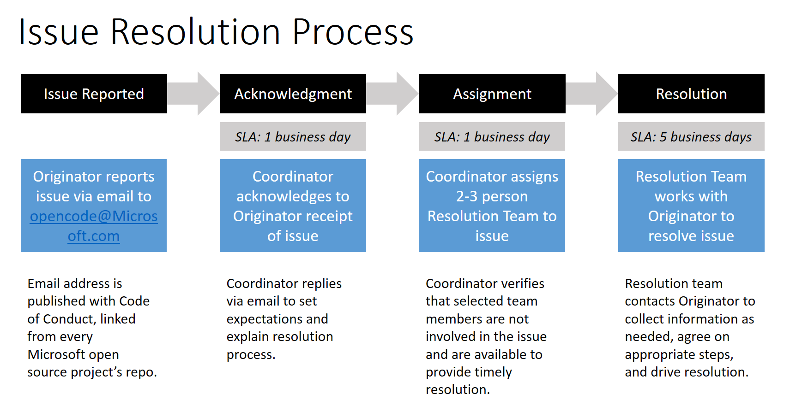

# Microsoft Open Source Code of Conduct FAQ

## Contents

* [Why have a Code of Conduct?](#whycode)
* [Why this Code of Conduct?](#whythis)
* [Why do this across all repos?](#allrepos)
* [How does a project adopt the code and process?](#howadopt)
* [What if my Microsoft project already has a Code of Conduct?](#alreadyhave)
* [How do I raise a concern?](#howreport)
* [What is the process for addressing issues that arise?](#process)
* [How does the resolution team work?](#howteamworks)
* [Can I use this Code of Conduct in my projects?](#caniuse)

## <a name="whycode"></a>Why have a Code of Conduct?
People and communities are the foundation of open source. Communities thrive through diversity of thought and the safety of its members. Microsoft has a deep-seated commitment to diversity and inclusion. All Microsoft employees enjoy a safe work environment and a culture of mutual respect and responsibility. Our team members and open source partners should enjoy the same environment when collaborating on open source projects.

While conduct issues seldom arise, when they do, they are often very public and very passionate. It is best for the community to be prepared with:

* A clear and accessible **Code of Conduct** stating the norms under which projects operate
* An **Issue Resolution Process** for addressing cases where these norms are not being maintained

## <a name="whythis"></a>Why this Code of Conduct?
The [Microsoft Open Source Code of Conduct](https://opensource.microsoft.com/codeofconduct/) is an instantiation of the [TODO Group](http://todogroup.org/) Code of Conduct template, that captures the Microsoft culture of equality, respect and inclusion. This same template is used by industry colleagues such as Facebook, Twitter, GitHub, Yahoo and others in their open source projects.

## <a name="allrepos"></a>Why do this across all repos?
Having one code and process is both efficient and consistent &mdash; community members can participate in any Microsoft-driven project and be confident that they know the norms and that they are supported by a robust process.

## <a name="howadopt"></a>How does a project adopt the code and process?
All Microsoft projects are automatically covered by the Code of Conduct and the Issue Resolution Process. **However**, it is critical that everyone in the communities be aware of the code and process. For that reason, all projects must link to the Code of Conduct in their README and/or CONTRIBUTING files using the following markdown.

```
This project has adopted the [Microsoft Open Source Code of
Conduct](https://opensource.microsoft.com/codeofconduct/).
For more information see the [Code of Conduct
FAQ](https://opensource.microsoft.com/codeofconduct/faq/) or
contact [opencode@microsoft.com](mailto:opencode@microsoft.com)
with any additional questions or comments.
```

## <a name="alreadyhave"></a>What if my Microsoft project already has a Code of Conduct?
Thanks for being proactive in this important area. You are welcome to continue using your existing Code of Conduct, or you may change to the [Microsoft Open Source Code of Conduct](https://opensource.microsoft.com/codeofconduct/). Either way, all Microsoft projects must use the same issue resolution process. Please ensure that your documentation and guidance is updated to point people at the process outlined in this FAQ (see below).

Projects in the .NET Foundation are already covered by the [.NET Foundation Contributors Code of Conduct](https://www.dotnetfoundation.org/code-of-conduct). As such, there is no need for .NET Foundation projects to make any changes.

## <a name="howreport"></a>How do I raise a concern?
If you have witnessed or been subjected to a violation of the Code of Conduct, please send an email to [opencode@microsoft.com](mailto:opencode@microsoft.com). Your message will be handled in a secure and confidential manner. This email address is monitored by people who are not active in open source projects or communities &mdash; so you can be sure that you are not communicating with a person involved in the issue you are reporting. You will receive a response within one business day acknowledging receipt of your email and describing the process for its resolution. (See below for more details.)

## <a name="process"></a>What is the process for addressing issues that arise?
Emails sent to [opencode@microsoft.com](mailto:opencode@microsoft.com) kick off the following process:

* Your message will be acknowledged within one business day.
* Within the following business day, a small, 2-3, person team will be assembled from a pool of Microsoft employee volunteers to review your concern. This team will be as diverse as possible given its size and will pull in additional people as needed to gain further insight and provide guidance. The team will not include anyone directly involved in the issue that has been raised.
* From there team will work with you and the others involved to come to a conclusion. While issue complexity varies, the goal is to resolve issues within five working days.
* All communication will be confidential with very limited circulation.



## <a name="howteamworks"></a>How does the resolution team work?
Beyond the norms and values set out in the Code of Conduct, issue review teams operate under the following principles:

* **Less is more** &mdash; As much as possible, let the community work it out. It is much better to have communities self-correct than to have outsiders come in and “fix” problems.
* **Equality** &mdash; Contribution value or status in the community are not relevant to the review. Key people do not have more rights (either to abuse or be protected from abuse) than others in the community.
* **Independence** &mdash; Reviewers must act and be seen to act with independence from the project(s) in question and from Microsoft.

## <a name="caniuse"></a>Can I use this Code of Conduct in my projects?
Yes. The document is licenced under [CC BY 4.0](https://creativecommons.org/licenses/by/4.0). You will of course need to update the document to suit the specifics of your projects, but by all means use this however you can to drive great communities.
